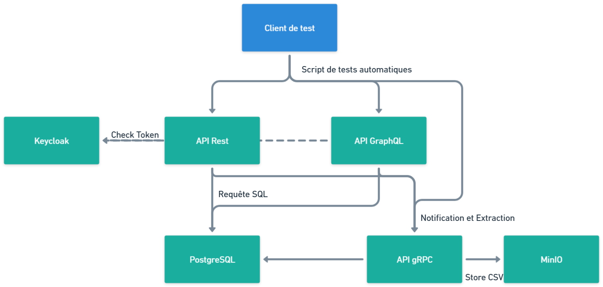

# Spécifications Techniques

## Contexte et objectifs

- Plateforme de réservation de salles : Permettre à des utilisateurs de réserver une ou plusieurs salles pour des créneaux horaires spécifiques (réunions, coworking, etc.).
3 applications distinctes :
- API REST (exposée en HTTP, documentée avec Swagger/OpenAPI).
- API GraphQL (permettant des requêtes/mutations ciblées sur les données).
- Service gRPC (responsable des notifications, qui pour la démo seront simplement stockées en base).
- Sécurisation : Les accès à l’API REST et à l’API GraphQL doivent être protégés par JWT via un Keycloak central.
- Base de données : PostgreSQL, exécutée dans un conteneur Docker.

## Architecture générale
(voir le schéma ci-dessous)


## Documentations

- [API REST](api_rest.md)
- [API GraphQL](api_graphql.md)
- [API gRPC](api_grpc.md)
- [Base de données](database.md)
- [Keycloak](../keycloak/keycloak.md)
- [MinIO](minio.md)

## Docker compose

Un docker compose est fourni pour démarrer l'ensemble des services nécessaires pour le projet. Il est possible de démarrer l'ensemble des services avec la commande suivante :
Tous les identifiants et mots de passe sont configurés dans le `docker-compose.yml` pour faciliter la mise en place du projet.
- [docker-compose.yml](docker-compose.yml)
```bash
docker compose up
```
